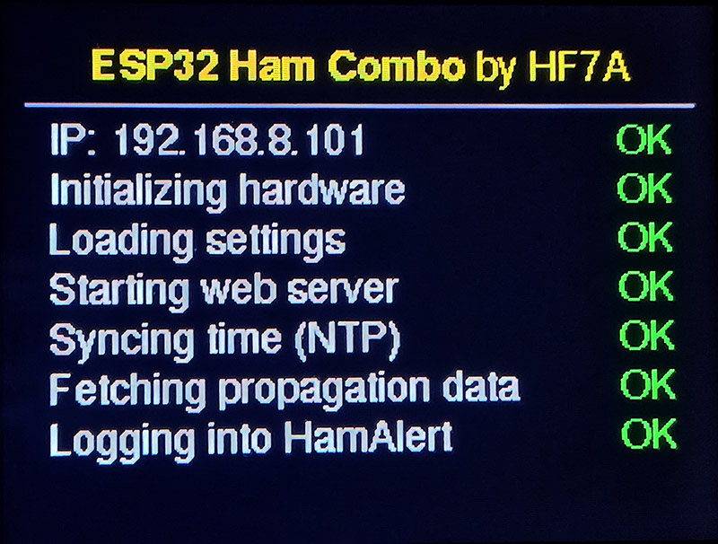
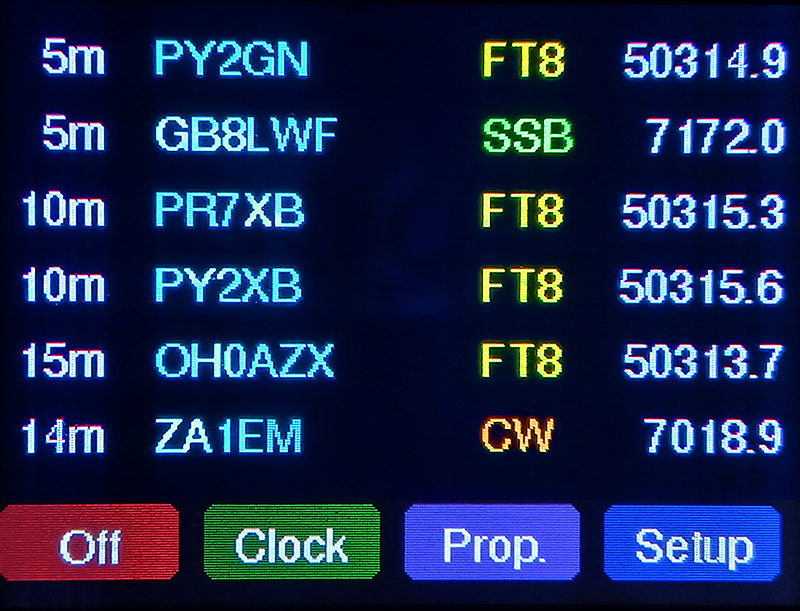
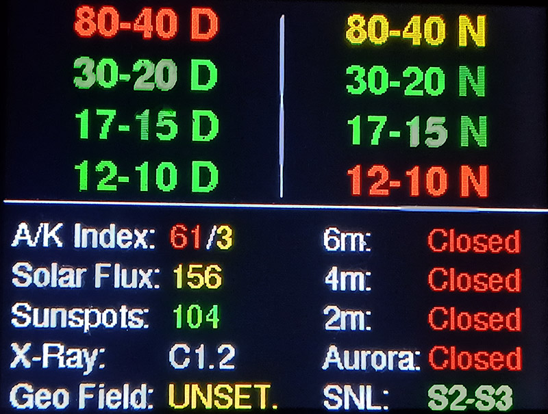
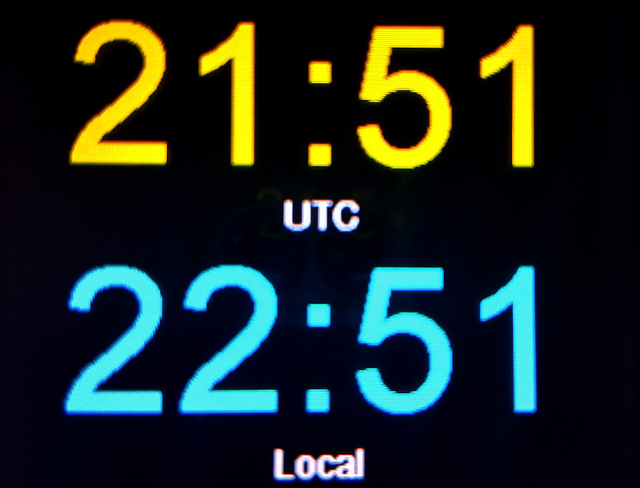
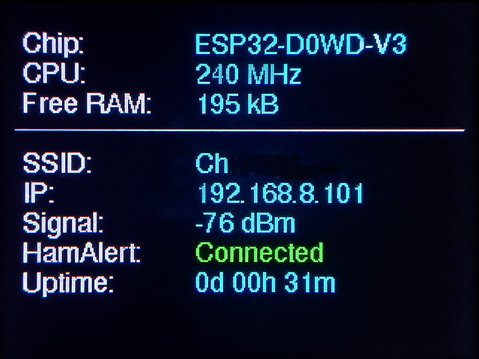

# ESP32 Ham Combo

A standalone **DX Cluster and Propagation Monitor** for ham radio operators. This touchscreen accessory provides real-time spots from HamAlert.org and detailed solar-terrestrial data for propagation forecasting on a color display.

The project is designed for the popular and affordable **ESP32-2432S028R** board (commonly known as the **CYD** - Cheap Yellow Display) but can be adapted for other similar ESP32-based display modules.

---

## Screenshots

| | | |
|:---:|:---:|:---:|
|    *System Startup Sequence* |    *Main Screen (5 Spots + Prop)* |    *Main Screen (6 Spots)* |
|    *Extended Propagation View* |    *Clock Screen (UTC + Local)* |    *Device Info Screen* |

---

## Key Features

*   **Real-Time DX Spots:** Connects directly to **HamAlert.org** via telnet to display the latest DX spots.
*   **Comprehensive Propagation Data:** Fetches and displays key solar data from **HamQSL.com**.
*   **Adjustable Backlight:** Control the screen brightness directly from the settings menu.
*   **Dual-View Main Screen:** Choose between a full 6-spot view or a 5-spot view with a compact propagation summary footer.
*   **Multiple Clock Modes:** Display time in UTC, local time, or both simultaneously.
*   **Intuitive Touch Interface:** All functions and settings are accessible via the touchscreen.
*   **Web-Based Configuration:** A full settings panel accessible from any web browser on your network.
*   **On-Screen Touch Calibration:** A built-in routine to calibrate the touchscreen for perfect accuracy.
*   **Persistent Settings:** All your configurations are saved to the device's flash memory and automatically reloaded on startup.
*   **Power Management:** Includes options for an inactivity-based deep sleep timer and a daily sleep/wake schedule.
*   **Audible Alerts:** Plays a configurable tone for new spots (requires an external speaker).
*   **Automatic Update Checks:** Periodically checks GitHub for new firmware releases and notifies you on the screen.

---

## Hardware Requirements & Adaptation

This project is specifically tailored for the **ESP32-2432S028R** board, powered via its standard USB port.

### Optional Speaker for Audio Alerts

The board includes a **2-pin Micro JST (1.25mm pitch) female connector** for attaching a small external speaker (e.g., 8 Ohm, 0.5W). This enables audible alerts for new DX spots.

The volume is software-adjustable with four predefined levels (plus a mute option). If the lowest setting is still too loud, it is recommended to connect the speaker in series with a current-limiting resistor (a value between **100-500 Ohms** is a good starting point) to further decrease the volume.

> **:warning: Important Note on Board Variations:**
> There are several hardware revisions of the ESP32-2432S028R board. While they may look identical, they can have minor differences in pin connections. The `User_Setup.h` file provided in this repository is configured for a common version. If you experience issues, you may need to **adjust the pin definitions in this file** to match your specific board.
>
> Additionally, some board revisions may exhibit inverted colors out of the box (e.g., white text appearing black). This is easily corrected by toggling the **'Invert Colors'** option in the **Display Settings** menu.
>
> Also, some displays may require a different orientation. Use the **Screen Rotation** setting in the Display Settings menu to rotate the screen in 90-degree increments.

---

## Installation Guide

**1. Prepare Arduino IDE**
*   Install the [Arduino IDE](https://www.arduino.cc/en/software) and the [ESP32 board manager](https://docs.espressif.com/projects/arduino-esp32/en/latest/installing.html).
*   Select **ESP32 Dev Module** as your board.

**2. Install Required Libraries**
*   In the Library Manager, install:
    *   [`TFT_eSPI`](https://github.com/Bodmer/TFT_eSPI)
    *   [`XPT2046_Touchscreen`](https://github.com/PaulStoffregen/XPT2046_Touchscreen)
    *   [`ESPAsyncWebServer`](https://github.com/ESP32Async/ESPAsyncWebServer)
    *   [`AsyncTCP`](https://github.com/ESP32Async/AsyncTCP)
    *   [`ArduinoJson`](https://github.com/bblanchon/ArduinoJson)
    *   [`ArduinoHttpClient`](https://github.com/arduino-libraries/ArduinoHttpClient)

**3. Configure the Display Library (Crucial Step!)**
*   Locate the `TFT_eSPI` library folder on your computer.
*   **Replace** the `User_Setup.h` file inside it with the `User_Setup.h` file from this project.

**4. Upload the Firmware**
*   Open the `ESP32_ham_combo.ino` file, select the correct COM port, and click "Upload".

---

## First-Time Setup & Configuration

### Wi-Fi and HamAlert Credentials

On the first boot, the device enters **Configuration Mode**.
1.  Connect to the Wi-Fi network **`ESP32-Ham-Combo-Setup`**.
2.  Open a browser and go to **`http://192.168.4.1`**.
3.  Enter your home Wi-Fi details and HamAlert credentials.
4.  Save and restart.

### Configuring HamAlert (Mandatory for DX Spots)

> **:exclamation: This is a required step to receive any spots!**
>
> You **must** configure your HamAlert account to send spots via Telnet.
> 1.  Log in to [hamalert.org](https://hamalert.org).
> 2.  Go to **Triggers**.
> 3.  For each trigger you want to see on the device, ensure the **Telnet** action is **enabled**.

### Web Interface

After connecting to your network, you can access the full settings panel by entering the device's IP address (shown on startup) into your browser. Advanced settings, such as **Timezone and Daylight Saving Time rules**, are only available through this web interface. You can also start the **touchscreen calibration** process from here.

---

## Basic Operation

The interface is controlled entirely by the touchscreen.

*   **Buttons:** Use the on-screen buttons like `Clock`, `Prop.`, `Setup`, and `Back` for primary navigation.
*   **Tap to Return:** On full-screen views that do not have a "Back" button (such as the **Clock** and **Propagation** screens), simply **tap anywhere on the screen** to return to the main spots view.
*   **Tap to Wake:** To wake the device from deep sleep (when the screen is off), **tap the screen once**.

---

## Data Refresh Intervals

*   **DX Spots:** DX Spots are received in **real-time**. The device maintains a persistent connection to HamAlert, and new spots are displayed the moment they are received. For added reliability, the connection is automatically refreshed every hour.
*   **Spot Elapsed Time:** The elapsed time next to each spot (e.g., `5m`) is updated every **30 seconds**.
*   **Propagation Data:** The solar and propagation data is fetched from HamQSL.com every **30 minutes**.
*   **Firmware Update Check:** The device checks for new software versions on GitHub once every **24 hours**, if this feature is enabled in the settings.

---

## Understanding the Propagation Display

The colors on the propagation screen are based on standard conventions to help you quickly assess conditions. The thresholds are adapted from resources like [qsl.net/4x4xm](https://www.qsl.net/4x4xm/HF-Propagation.htm).

| Parameter | 🟢 Best | 🟡 Average | 🟠 Poor / Low | 🔴 Bad |
| :--- | :---: | :---: | :---: | :---: |
| **Solar Flux (SFI)** | ≥ 172 | 124-171 | 83-123 | < 83 |
| **K-Index** | 0-1 | 2-3 | 4-6 | ≥ 7 |
| **A-Index** | 0-7 | 8-15 | 16-47 | ≥ 48 |
| **X-Ray Flares** | A, B, C | - | M-class | X-class |

---

## Troubleshooting

**Unresponsive or Inaccurate Touchscreen**

If the touch input is not working correctly after the first setup, or becomes inaccurate over time, follow these steps.

1.  **Run Calibration from the Web Interface**
    *   Go to the device's web interface using its IP address.
    *   Click the "Start Touch Calibration" button.
    *   Follow the instructions on the device's screen. This is the primary method to fix calibration issues.

2.  **If Calibration Fails or is Inaccessible**
    *   This can happen if the touch controller pins in your `User_Setup.h` are incorrect for your specific board revision, causing the calibration routine itself to fail.
    *   To perform a full reset, you must erase the entire flash memory, which stores the faulty calibration data.
    *   In the Arduino IDE, go to `Tools > Erase All Flash Before Sketch Upload` and select `Enabled`.
    *   Re-upload the sketch.
    *   > **:warning: This will completely wipe the device**, including Wi-Fi settings, forcing it back into the initial configuration mode.

---

## License

This project is released under the **CC BY-NC-SA 4.0 License** (Attribution-NonCommercial-ShareAlike 4.0 International) by **Leszek (HF7A)**.

**Commercial use is prohibited.**

See the [LICENSE](LICENSE) file for details.

## Acknowledgements

#### Data Services
*   DX spot data is provided by **[HamAlert.org](https://hamalert.org/)**.
*   Solar propagation data is courtesy of **[HamQSL.com](https://www.hamqsl.com/)**.

#### Libraries
*   [`TFT_eSPI`](https://github.com/Bodmer/TFT_eSPI)
*   [`XPT2046_Touchscreen`](https://github.com/PaulStoffregen/XPT2046_Touchscreen)
*   [`ESPAsyncWebServer`](https://github.com/ESP32Async/ESPAsyncWebServer)
*   [`ArduinoJson`](https://github.com/bblanchon/ArduinoJson)
*   and others.

#### Inspiration
*   The initial concept for fetching and parsing propagation data from HamQSL.com was inspired by the [HamQSL-XML-Parser](https://github.com/canislupus11/HamQSL-XML-Parser) project by canislupus11.
